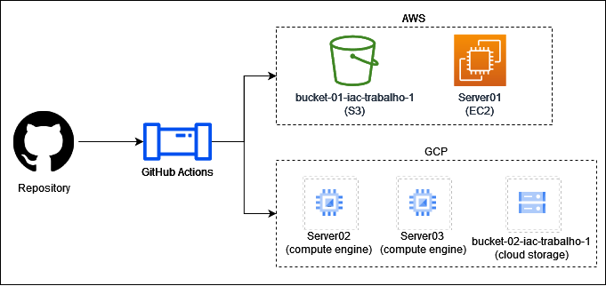

# IaC-Trabalho-1
## Context
This project consists of a architecture capable of deploy instances at AWS and GCP.
See the digram below:



* Server 01 has RUNDECK installed. [Check the installation script here.](https://github.com/juliavpaiva/IaC-Trabalho-1/blob/main/aws/main-infrastructure/startup_script_server01.sh)
* Server 02 has Apache, MySQL and PHP Installed. [Check the installation script here.](https://github.com/juliavpaiva/IaC-Trabalho-1/blob/main/gcp/main-infrastructure/startup_script_server02.sh)
* Server 03 has Jenkins installed. [Check the installation script here.](https://github.com/juliavpaiva/IaC-Trabalho-1/blob/main/gcp/main-infrastructure/startup_script_server03.sh)
* Buckets are used to store Terraform state for each infra.
* Scripts are used to install required tools, such as RUNDECK, jenkins and others.

## Operational Flow


### Expected flow

1. User goes to Actions tab and manually activates the `State Infrasctructure`:

- Actions trigger `terraform plan` and `terraform apply` creation of buckets
- Each cloud has its own action workflow, two need to be activated to create both buckets
- [AWS workflow](https://github.com/juliavpaiva/IaC-Trabalho-1/actions/workflows/aws_state_infrastructure_tf_apply.yml)
- [GCP workflow](https://github.com/juliavpaiva/IaC-Trabalho-1/actions/workflows/gcp_state_infrastructure_tf_apply.yml)
        
2. User pushes code on a branch
3. User creates pull request:
- Pull request triggers `terraform plan` for infra that is being updated
- If GCP infra is updated, plan runs only for GCP
- If AWS infra is updated, plan runs only for AWS
- Information is stored at assigned bucket

4. User approves pull request:
- Pull request triggers `terraform apply` for infra that is being updated
- Resources are created according to plan stored at the bucket
- There are two different workflows for the clouds and like the previous step, it is identified by the folder which was altered
- Information is stored at assigned bucket
- Resources are created or updated

5. User goes to Actions tab and manually activates the `Destroy Infrasctructure`:
- Each cloud has its own action workflow, two need to be activated to create destroy all infrastructures
- Actions trigger `terraform destroy`
- Servers are deleted

## How to run
### Before running the project:
1. Fork project
2. Create IAM users at AWS and GCP
3. Create GitHub Token
4. Add access keys at `Settings > Secrets`
- The following will be needed:
    - AWS_ACCESS_KEY_ID
    - AWS_SECRET_ACCESS_KEY
    - GOOGLE_CREDENTIALS

-----

### Step 1: Create bucket to store terraform state
- Go to Actions tab
- For AWS:
    - Select ['AWS - Create terraform plan and apply for State Infrastructure'](https://github.com/juliavpaiva/IaC-Trabalho-1/actions/workflows/aws_state_infrastructure_tf_apply.yml)
- For GCP:
    - Select ['GCP - Create terraform plan and apply for State Infrastructure'](https://github.com/juliavpaiva/IaC-Trabalho-1/actions/workflows/gcp_state_infrastructure_tf_apply.yml)
- Click at the dropdown 'Run workflow' on the left side of the table
- Run the workflow

#### AWS
[Check this successful run for further information](https://github.com/juliavpaiva/IaC-Trabalho-1/actions/runs/3470388420)

#### GPC
[Check this successful run for further information](https://github.com/juliavpaiva/IaC-Trabalho-1/actions/runs/3473674643/jobs/5805956836)
    
-----

### Step 2: Open pull request to initiate the plan workflow
- Update code
- Create branch
- Commit and push changes
- Open pull request

This will start the plan workflow, check the following examples for further information:

#### AWS
- [Pull Request](https://github.com/juliavpaiva/IaC-Trabalho-1/pull/2)
- [Plan workflow run](https://github.com/juliavpaiva/IaC-Trabalho-1/actions/runs/3470937067/jobs/5799770540)

#### GCP
- [Pull Request](https://github.com/juliavpaiva/IaC-Trabalho-1/pull/5)
- [Plan workflow run](https://github.com/juliavpaiva/IaC-Trabalho-1/actions/runs/3474059793/jobs/5806795478)
    
-----

### Step 3: Merge the opened pull request to initiate the apply worflow
- At the previously opened pull request, click at the `Merge pull request` button

#### AWS
[Check this successfully merged request job execution](https://github.com/juliavpaiva/IaC-Trabalho-1/actions/runs/3470944698)

(Be aware that Terraform will use the default VCP that comes with your account when you first activate it)

#### GCP
[Check this successfully merged request job execution](https://github.com/juliavpaiva/IaC-Trabalho-1/actions/runs/3474088703/jobs/5806856118)

- To cerfify that everything went through, you can Log In at the VM through SSH to see if packages were installed. (This step is not necessary, is only an additional check to prove that the scripts work as expected)
```
julia@server02:~$ systemctl status apache2.service
● apache2.service - The Apache HTTP Server
   Loaded: loaded (/lib/systemd/system/apache2.service; enabled; vendor preset: enabled)
  Drop-In: /lib/systemd/system/apache2.service.d
           └─apache2-systemd.conf
   Active: active (running) since Wed 2022-11-16 23:33:07 UTC; 12s ago
  Process: 25250 ExecStop=/usr/sbin/apachectl stop (code=exited, status=0/SUCCESS)
  Process: 25255 ExecStart=/usr/sbin/apachectl start (code=exited, status=0/SUCCESS)
 Main PID: 25278 (apache2)
    Tasks: 6 (limit: 2322)
   CGroup: /system.slice/apache2.service
           ├─25278 /usr/sbin/apache2 -k start
           ├─25283 /usr/sbin/apache2 -k start
           ├─25284 /usr/sbin/apache2 -k start
           ├─25285 /usr/sbin/apache2 -k start
           ├─25287 /usr/sbin/apache2 -k start
           └─25289 /usr/sbin/apache2 -k start

Nov 16 23:33:07 server02 systemd[1]: Starting The Apache HTTP Server...
Nov 16 23:33:07 server02 systemd[1]: Started The Apache HTTP Server.
```
---
```
julia@server03:~$ service jenkins status
● jenkins.service - Jenkins Continuous Integration Server
   Loaded: loaded (/lib/systemd/system/jenkins.service; enabled; vendor preset: enabled)
   Active: activating (start) since Thu 2022-11-17 00:38:07 UTC; 1min 17s ago
 Main PID: 8362 (java)
    Tasks: 50 (limit: 2322)
   CGroup: /system.slice/jenkins.service
           └─8362 /usr/bin/java -Djava.awt.headless=true -jar /usr/share/java/jenkins.war --webroot=/var/cache/

Nov 17 00:38:45 server03 jenkins[8362]: WARNING: Please consider reporting this to the maintainers of org.codeh
Nov 17 00:38:45 server03 jenkins[8362]: WARNING: Use --illegal-access=warn to enable warnings of further illega
Nov 17 00:38:45 server03 jenkins[8362]: WARNING: All illegal access operations will be denied in a future relea
Nov 17 00:38:45 server03 jenkins[8362]: 2022-11-17 00:38:45.650+0000 [id=31]        INFO        jenkins.install
Nov 17 00:38:45 server03 jenkins[8362]: *************************************************************
Nov 17 00:38:45 server03 jenkins[8362]: Jenkins initial setup is required. An admin user has been created and a
Nov 17 00:38:45 server03 jenkins[8362]: Please use the following password to proceed to installation:
Nov 17 00:38:45 server03 jenkins[8362]: e0d9362d2c8e40d6a62e56e75cbb2ff9
Nov 17 00:38:45 server03 jenkins[8362]: This may also be found at: /var/lib/jenkins/secrets/initialAdminPasswor
Nov 17 00:38:45 server03 jenkins[8362]: *************************************************************
```

(Be aware that this code is considering that you are using a existing project used to create the credentials)

-----

### Step 4: Check created resorces at console
#### AWS
- Access the AWS Console and check your new EC2 instance
- At the AWS Console, access S3 and check for the new folder containing the terraform state

#### GCP
- Access the GCP Console and check your two new VM instances
- At the GCP Console, access Cloud Storage and check for the new folder containing the terraform state
    
-----

### Step 5: Run Destroyer
- Go to Actions tab
- For AWS:
    - Select 'Destroy terraform AWS Main Infrastructure Resources'
- Click at the dropdown 'Run workflow' on the left side of the table
- Run the workflow

#### AWS
[Check this successful run for further information](https://github.com/juliavpaiva/IaC-Trabalho-1/actions/runs/3471323350/jobs/5800664792)

#### GCP
[Check this successful run for further information](https://github.com/juliavpaiva/IaC-Trabalho-1/actions/runs/3474178940/jobs/5807046676)
    
-----

### Step 4: Check destroyed resources at console
#### AWS
- Access the AWS Console to see that EC2 instance was deleted
